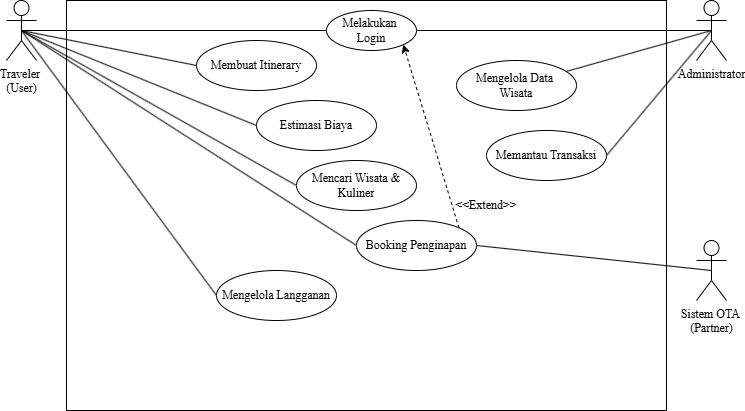

# Software Design Description
## For GasssTrip Indonesia

Version 1.0  
Prepared by Nabila Khansa Ginanjar, Siti Rakhma Nursyifa, Zulfa Sahliya Padilah, Zahroh Nur Salsabila  
Universitas Halim Sanusi  
03 Juni 2026

## Table of Contents
<!-- TOC -->
* [1. Introduction](#1-introduction)
  * [1.1 Document Purpose](#11-document-purpose)
  * [1.2 Subject Scope](#12-subject-scope)
  * [1.3 Definitions, Acronyms, and Abbreviations](#13-definitions-acronyms-and-abbreviations)
  * [1.4 References](#14-references)
  * [1.5 Document Overview](#15-document-overview)
* [2. Design Overview](#2-design-overview)
  * [2.1 Stakeholder Concerns](#21-stakeholder-concerns)
  * [2.2 Selected Viewpoints](#22-selected-viewpoints)
* [3. Design Views](#3-design-views)
* [4. Decisions](#4-decisions)
* [5. Appendixes](#5-appendixes)
<!-- TOC -->

## Revision History

| Name | Date | Reason For Changes | Version |
|------|------|--------------------|---------|
| Tim GasssTrip | 03 Juni 2026 | Initial draft | 1.0 |

---

## 1. Introduction

Bagian ini memberikan gambaran umum dokumen dan mengorientasikan pembaca terhadap sistem GasssTrip Indonesia yang dirancang.

### 1.1 Document Purpose

Dokumen Software Design Description (SDD) ini disusun untuk mendeskripsikan rancangan teknis sistem Itinerary Otomatis GasssTrip Indonesia sebelum tahap implementasi dimulai. Dokumen ini berfungsi sebagai panduan teknis komprehensif yang memastikan semua pihak yang terlibat memiliki pemahaman yang sama tentang arsitektur, elemen, dan pilihan desain dari sistem.

Audiens yang dituju dokumen meliputi:

- **Pengembang (developer)** – acuan teknis dalam penulisan kode dan integrasi komponen
- **Arsitek sistem** – validasi kesesuaian rancangan dengan standar arsitektur yang ditetapkan
- **Tim penguji (tester)** – pemahaman alur sistem untuk menyusun skenario pengujian
- **Tim pemeliharaan (maintainer)** – referensi saat melakukan perawatan dan pengembangan lanjutan
- **Project manager** – pengawasan jangkauan teknis dan manajemen risiko proyek

### 1.2 Subject Scope

Sistem yang dirancang adalah **GasssTrip Indonesia versi 1.0** – platform digital berbasis web dan mobile yang mengotomatisasi perencanaan perjalanan wisata di Indonesia. Sistem ini hadir sebagai solusi atas permasalahan *information overload* dan kesulitan penyusunan jadwal manual yang dialami wisatawan, terutama akibat variabel lokal yang dinamis seperti kemacetan, cuaca, dan ketersediaan destinasi.

Kapabilitas utama sistem yang dicakup dalam dokumen ini:

- **Input perjalanan** – pengguna memasukkan kota tujuan, jumlah hari, dan anggaran
- **Rekomendasi cerdas** – sistem merekomendasikan tempat wisata dan kuliner berbasis preferensi
- **Penyusunan itinerary otomatis** – menghasilkan rencana perjalanan terstruktur secara otomatis
- **Estimasi biaya perjalanan** – perhitungan estimasi biaya real-time
- **Fitur langganan (subscription)** – akses fitur premium melalui mekanisme berlangganan
- **Integrasi API eksternal** – Google Maps, layanan wisata, dan data transportasi

### 1.3 Definitions, Acronyms, and Abbreviations

| Istilah / Akronim | Definisi |
|-------------------|----------|
| API | Application Programming Interface – antarmuka pemrograman untuk integrasi layanan eksternal |
| SDD | Software Design Description – dokumen rancangan perangkat lunak sebelum implementasi |
| SRS | Software Requirements Specification – dokumen spesifikasi kebutuhan sistem |
| UML | Unified Modeling Language – bahasa pemodelan visual standar untuk desain sistem |
| AI | Artificial Intelligence – kecerdasan buatan yang digunakan untuk sistem rekomendasi GasssTrip |
| MVP | Minimum Viable Product – versi produk dengan fitur inti yang cukup untuk pengujian awal |
| UCP | Use Case Point – metode estimasi ukuran dan waktu pengembangan perangkat lunak |
| TELOS | Technical, Economic, Legal, Operational, Schedule – kerangka penilaian studi kelayakan |
| PDP | Perlindungan Data Pribadi – regulasi UU No.27/2022 tentang perlindungan data pengguna |
| Itinerary | Rencana perjalanan terstruktur yang mencakup destinasi, jadwal, dan estimasi biaya |
| Hidden Gem | Destinasi wisata yang kurang dikenal namun memiliki nilai wisata yang tinggi |
| JWT | JSON Web Token – token autentikasi stateless untuk manajemen sesi pengguna |
| OTA | Online Travel Agent – mitra agen perjalanan daring (Tiket.com, Agoda, Booking.com, dll.) |

### 1.4 References

| ID | Judul | Tipe |
|----|-------|------|
| REF-01 | Laporan Studi Kelayakan Sistem Itinerary Otomatis GasssTrip Indonesia, 14 April 2026 | Normatif |
| REF-02 | IEEE Std 1016-2009 – IEEE Standard for Information Technology: Software Design Descriptions | Normatif |
| REF-03 | UU No. 27 Tahun 2022 tentang Perlindungan Data Pribadi (PDP) – Pemerintah RI | Normatif |
| REF-04 | UU No. 19 Tahun 2016 tentang Informasi dan Transaksi Elektronik (ITE) | Normatif |
| REF-05 | PP No. 71 Tahun 2019 tentang Penyelenggaraan Sistem dan Transaksi Elektronik (PSTE) | Normatif |
| REF-06 | Hall, J. A. (2009). *Accounting Information Systems*, 7th ed., Cengage Learning | Informatif |
| REF-07 | Whitten, J. L., Bentley, L. D., & Dittman, K. C. (2004). *System Analysis and Design Method*, 6th ed., McGraw-Hill | Informatif |

### 1.5 Document Overview

Dokumen SDD ini disusun dalam lima bagian utama yang saling berkaitan: Bagian 1 (*Introduction*) menetapkan tujuan, ruang lingkup, dan referensi dokumen. Bagian 2 (*Design Overview*) menjelaskan kepentingan pemangku kepentingan dan sudut pandang desain yang dipilih. Bagian 3 (*Design Views*) mendokumentasikan elemen arsitektur utama melalui deskripsi dan diagram. Bagian 4 (*Decisions*) merekam seluruh keputusan desain signifikan beserta rasionalisasinya. Bagian 5 (*Appendixes*) memuat materi pendukung termasuk Revision History dan ringkasan kelayakan.

Pembaruan dokumen dikelola melalui Revision History pada Appendix A. Konvensi penomoran: bagian menggunakan angka (1, 2, 3), sub-bagian menggunakan titik (1.1, 2.2), dan elemen desain menggunakan ID tiga digit (001, 002, dst.).

---

## 2. Design Overview

Bagian ini mendeskripsikan pendekatan arsitektur sistem GasssTrip Indonesia dan pemangku kepentingan yang terlibat.

### 2.1 Stakeholder Concerns

GasssTrip Indonesia melibatkan berbagai pemangku kepentingan dengan kepentingan desain yang berbeda. Semua anggota tim berkolaborasi secara aktif dan dokumen SDD ini berfungsi sebagai alat komunikasi teknis.

| Pemangku Kepentingan | Kepentingan Utama | Bagian SDD yang Menjawab |
|----------------------|-------------------|--------------------------|
| Pengguna Akhir (Wisatawan) | Kemudahan penggunaan, kecepatan, akurasi itinerary | 3. Design Views (Context, Interaction) |
| Pengembang | Kejelasan arsitektur, modularitas, integrasi API | 3. Design Views, 4. Decisions |
| Project Manager | Cakupan teknis, jadwal, mitigasi risiko | 4. Decisions, 5. Appendixes |
| Project Sponsor | ROI, keamanan data, kepatuhan hukum | 1.2 Subject Scope, 4. Decisions |
| Tim Pemeliharaan | Kemudahan pemeliharaan, dokumentasi rinci | 3. Design Views, 5. Appendixes |
| Regulator / Hukum | Kepatuhan UU PDP, ITE, PSTE | 4. DEC-003 |

### 2.2 Selected Viewpoints

Sudut pandang berikut dipilih berdasarkan kepentingan pemangku kepentingan di atas. Setiap sudut pandang menggunakan bahasa visualisasi standar dan menjadi dasar Design Views pada Bagian 3.

| Sudut Pandang | Kepentingan yang Dijawab | Bahasa Visual |
|---------------|--------------------------|---------------|
| Context | Batas sistem, aktor eksternal (pengguna, API Maps, API wisata) | UML Use Case Diagram |
| Composition | Dekomposisi modul: Frontend, Backend, AI Engine, Database | UML Component Diagram |
| Logical | Struktur kelas: User, Trip, Itinerary, Destination, Subscription | UML Class Diagram |
| Information | Model data: relasi entitas utama dan skema database | Entity-Relationship Diagram |
| Interaction | Alur: input pengguna – AI rekomendasi – output itinerary | UML Sequence Diagram |
| Deployment | Pemetaan komponen ke infrastruktur: server, CDN, cloud | UML Deployment Diagram |
| Interface | Kontrak API: Google Maps, layanan wisata, payment gateway | API Specification |

---

## 3. Design Views

Mendokumentasikan elemen arsitektur dan desain utama sistem GasssTrip Indonesia. Setiap view menggunakan deskripsi dan diagram untuk menjelaskan sistem secara visual dan terstruktur.

---

### 001 – Context View: Batas Sistem GasssTrip Indonesia

- **ID:** 001-context-view
- **Title:** Batas Sistem, Aktor, dan Use Case GasssTrip Indonesia
- **Viewpoint:** Context
- **Representation:**

Sistem GasssTrip Indonesia berinteraksi dengan tiga aktor utama yang teridentifikasi dari Use Case Diagram:

| Aktor | Tipe | Peran dalam Sistem |
|-------|------|-------------------|
| Traveler (User) | Aktor Utama | Pengguna akhir yang merencanakan perjalanan, mengakses fitur itinerary, estimasi biaya, pencarian wisata, booking, dan langganan |
| Administrator | Aktor Internal | Mengelola data wisata dan memantau seluruh transaksi yang terjadi di platform |
| Sistem OTA (Partner) | Aktor Eksternal | Sistem mitra Online Travel Agent (Tiket.com, Agoda, Booking.com, dll.) yang menyediakan data dan layanan booking penginapan |

> **Catatan:** Use case booking penginapan memiliki relasi `<<extend>>` terhadap use case melakukan login, artinya fitur booking hanya dapat diakses setelah pengguna berhasil login terlebih dahulu.
**UC-01: Melakukan Login**
#### Deskripsi Use Case Utama

| Field | Keterangan |
|-------|------------|
| Use Case ID | UC-01 |
| Nama | Melakukan Login |
| Aktor | Traveler (User), Administrator |
| Deskripsi | Pengguna melakukan autentikasi ke sistem dengan memasukkan kredensial (email dan password) untuk mengakses fitur-fitur yang memerlukan sesi aktif. |
| Pra-kondisi | Pengguna telah memiliki akun terdaftar di sistem GasssTrip Indonesia. |
| Alur Utama | 1. Pengguna membuka halaman login. 2. Pengguna memasukkan email dan password. 3. Sistem memvalidasi kredensial ke database. 4. Sistem menghasilkan token sesi (JWT). 5. Pengguna diarahkan ke halaman utama sesuai perannya (Traveler → dashboard wisata, Admin → panel admin). |
| Alur Alternatif | Jika kredensial salah: sistem menampilkan pesan error dan meminta input ulang. Jika akun belum terverifikasi: sistem mengirim ulang email verifikasi. |
| Relasi | Di-extend oleh UC-05 (Booking Penginapan) – booking hanya dapat dilakukan setelah login. |
| Pasca-kondisi | Pengguna berhasil masuk dan sesi aktif tersimpan di sistem. |

**UC-02: Membuat Itinerary**

| Field | Keterangan |
|-------|------------|
| Use Case ID | UC-02 |
| Nama | Membuat Itinerary |
| Aktor | Traveler (User) |
| Deskripsi | Traveler membuat rencana perjalanan otomatis dengan memasukkan parameter perjalanan. Sistem secara otomatis menghasilkan itinerary harian yang tersusun berdasarkan preferensi pengguna menggunakan AI Recommendation Engine. |
| Pra-kondisi | Traveler telah login ke sistem. |
| Alur Utama | 1. Traveler memilih menu 'Buat Itinerary'. 2. Traveler mengisi form: kota tujuan, jumlah hari, dan budget. 3. Sistem memproses input melalui AI Recommendation Engine. 4. AI mengambil data destinasi dari database dan menghitung skor relevansi. 5. Itinerary Generator menyusun jadwal harian. 6. Sistem menampilkan itinerary lengkap beserta estimasi biaya. 7. Traveler dapat menyimpan, mengubah, atau berbagi itinerary. |
| Alur Alternatif | Jika budget terlalu rendah: sistem memberikan notifikasi dan menyarankan penyesuaian anggaran. Jika tidak ada destinasi tersedia: sistem merekomendasikan kota terdekat sebagai alternatif. |
| Relasi | Menggunakan data dari UC-03 (Mencari Wisata dan Kuliner) sebagai bahan rekomendasi. |
| Pasca-kondisi | Itinerary tersimpan di akun Traveler dan dapat diakses kembali kapan saja. |

**UC-03: Estimasi Biaya**

| Field | Keterangan |
|-------|------------|
| Use Case ID | UC-03 |
| Nama | Estimasi Biaya |
| Aktor | Traveler (User) |
| Deskripsi | Traveler mendapatkan perkiraan total biaya perjalanan secara otomatis berdasarkan itinerary yang telah dibuat, mencakup tiket masuk destinasi, transportasi antar lokasi, dan estimasi akomodasi. |
| Pra-kondisi | Traveler telah memiliki itinerary yang dibuat melalui UC-02. |
| Alur Utama | 1. Sistem mengambil data destinasi dari itinerary aktif. 2. Cost Estimator menghitung tiket masuk setiap destinasi. 3. Sistem menghitung estimasi biaya transportasi antar lokasi menggunakan data Google Maps. 4. Jika ada booking penginapan, biaya akomodasi ditambahkan. 5. Sistem menampilkan rincian dan total estimasi biaya per hari dan keseluruhan perjalanan. |
| Alur Alternatif | Jika data harga destinasi tidak tersedia: sistem menggunakan estimasi rata-rata dari kategori destinasi serupa. |
| Relasi | Dihasilkan otomatis bersamaan dengan UC-02 (Membuat Itinerary). |
| Pasca-kondisi | Traveler mendapatkan ringkasan biaya yang dapat dijadikan acuan perencanaan anggaran perjalanan. |

**UC-04: Mencari Wisata & Kuliner**

| Field | Keterangan |
|-------|------------|
| Use Case ID | UC-04 |
| Nama | Mencari Wisata dan Kuliner |
| Aktor | Traveler (User) |
| Deskripsi | Traveler dapat melakukan pencarian mandiri destinasi wisata dan tempat kuliner berdasarkan kata kunci, kategori, lokasi, atau filter tertentu seperti rating, harga, dan jarak. |
| Pra-kondisi | Traveler mengakses fitur pencarian (tidak harus login untuk fitur dasar; login diperlukan untuk menyimpan favorit). |
| Alur Utama | 1. Traveler membuka menu 'Cari Wisata dan Kuliner'. 2. Traveler memasukkan kata kunci atau memilih filter (kota, kategori, budget). 3. Sistem melakukan query ke database destinasi. 4. Sistem menampilkan daftar destinasi beserta rating, foto, jam buka, dan estimasi harga. 5. Traveler dapat memilih destinasi untuk melihat detail lengkap. 6. Traveler dapat menambahkan destinasi ke itinerary yang sudah ada. |
| Alur Alternatif | Jika tidak ada hasil: sistem menyarankan kata kunci serupa atau menampilkan destinasi populer di kota tersebut. |
| Relasi | Hasil pencarian dapat langsung ditambahkan ke UC-02 (Membuat Itinerary). |
| Pasca-kondisi | Traveler mendapatkan informasi destinasi yang relevan sesuai pencarian. |

**UC-05: Booking Penginapan**

| Field | Keterangan |
|-------|------------|
| Use Case ID | UC-05 |
| Nama | Booking Penginapan |
| Aktor | Traveler (User), Sistem OTA (Partner) |
| Deskripsi | Traveler melakukan pemesanan penginapan yang terintegrasi dengan sistem mitra OTA. Fitur ini memperluas (`<<extend>>`) use case Login, sehingga hanya dapat diakses oleh pengguna yang telah terautentikasi. |
| Pra-kondisi | Traveler telah login (UC-01). Traveler memiliki itinerary aktif dengan data kota dan tanggal perjalanan. |
| Alur Utama | 1. Traveler memilih menu 'Booking Penginapan' dari dalam itinerary. 2. Sistem mengirimkan permintaan ketersediaan ke Sistem OTA Partner. 3. Sistem OTA mengembalikan daftar penginapan tersedia beserta harga dan fasilitas. 4. Traveler memilih penginapan dan tanggal check-in/check-out. 5. Traveler mengkonfirmasi pemesanan dan melakukan pembayaran melalui payment gateway. 6. Sistem OTA mengkonfirmasi booking dan mengirimkan voucher ke email Traveler. 7. Biaya penginapan otomatis ditambahkan ke Estimasi Biaya (UC-03). |
| Alur Alternatif | Jika penginapan tidak tersedia: sistem menawarkan alternatif penginapan lain di lokasi terdekat. Jika pembayaran gagal: sistem membatalkan booking dan menginformasikan traveler. |
| Relasi | `<<extend>>` UC-01 (Melakukan Login) – wajib login sebelum booking. Terintegrasi dengan Sistem OTA (Partner) sebagai aktor eksternal. |
| Pasca-kondisi | Booking terkonfirmasi, voucher dikirim ke email, dan biaya tercatat di estimasi perjalanan. |

**UC-06: Mengelola Langganan**

| Field | Keterangan |
|-------|------------|
| Use Case ID | UC-06 |
| Nama | Mengelola Langganan |
| Aktor | Traveler (User) |
| Deskripsi | Traveler dapat berlangganan paket premium GasssTrip untuk mendapatkan akses ke fitur eksklusif seperti rekomendasi hidden gems, unlimited itinerary generation, export PDF, dan akses prioritas ke data destinasi terbaru. |
| Pra-kondisi | Traveler telah login ke sistem. |
| Alur Utama | 1. Traveler membuka menu 'Langganan'. 2. Sistem menampilkan pilihan paket (Gratis, Basic Premium, Full Premium) beserta perbandingan fitur dan harga. 3. Traveler memilih paket dan mengklik 'Berlangganan'. 4. Sistem mengarahkan ke payment gateway untuk pembayaran. 5. Setelah pembayaran berhasil, sistem mengaktifkan status premium akun traveler. 6. Traveler mendapatkan konfirmasi via email dan akses fitur premium langsung aktif. |
| Alur Alternatif | Jika pembayaran gagal: status langganan tetap tidak berubah. Jika langganan sudah aktif: sistem menampilkan opsi perpanjangan atau upgrade paket. |
| Relasi | Terkait dengan DEC-005 (Keputusan desain model Freemium). |
| Pasca-kondisi | Status akun traveler diperbarui menjadi premium dengan masa aktif sesuai paket yang dipilih. |

**UC-07: Mengelola Data Wisata**

| Field | Keterangan |
|-------|------------|
| Use Case ID | UC-07 |
| Nama | Mengelola Data Wisata |
| Aktor | Administrator |
| Deskripsi | Administrator dapat melakukan pengelolaan data master destinasi wisata dan kuliner, termasuk menambah, mengubah, menonaktifkan, dan memverifikasi data destinasi agar informasi yang ditampilkan kepada traveler selalu akurat dan terkini. |
| Pra-kondisi | Administrator telah login dengan akun yang memiliki hak akses admin. |
| Alur Utama | 1. Administrator membuka panel admin dan memilih menu 'Kelola Data Wisata'. 2. Sistem menampilkan daftar seluruh destinasi wisata yang terdaftar. 3. Administrator dapat: (a) Tambah destinasi baru dengan mengisi form lengkap (nama, lokasi, kategori, harga, foto, jam buka). (b) Edit data destinasi yang sudah ada. (c) Nonaktifkan destinasi yang sudah tutup atau tidak relevan. (d) Verifikasi destinasi yang dikirim oleh pengguna atau mitra. 4. Sistem menyimpan perubahan dan memperbarui cache data destinasi. |
| Alur Alternatif | Jika data tidak valid: sistem menampilkan pesan validasi dan mencegah penyimpanan data yang tidak lengkap. |
| Relasi | Data yang dikelola di UC-07 digunakan oleh UC-02, UC-03, dan UC-04. |
| Pasca-kondisi | Database destinasi wisata diperbarui dan perubahan langsung tersedia bagi traveler. |

**UC-08: Memantau Transaksi**

| Field | Keterangan |
|-------|------------|
| Use Case ID | UC-08 |
| Nama | Memantau Transaksi |
| Aktor | Administrator |
| Deskripsi | Administrator dapat melihat dan memantau seluruh transaksi yang terjadi di platform GasssTrip, termasuk transaksi pembayaran langganan premium, komisi booking penginapan dari mitra OTA, dan laporan pendapatan berkala. |
| Pra-kondisi | Administrator telah login dengan akun yang memiliki hak akses admin. |
| Alur Utama | 1. Administrator membuka panel admin dan memilih menu 'Pantau Transaksi'. 2. Sistem menampilkan dashboard transaksi dengan filter periode (harian, mingguan, bulanan). 3. Administrator dapat melihat: (a) Riwayat pembayaran subscription per pengguna. (b) Komisi dari booking penginapan via OTA Partner. (c) Total pendapatan dan grafik tren. (d) Status pembayaran (berhasil, gagal, pending). 4. Administrator dapat mengekspor laporan transaksi dalam format CSV atau PDF. |
| Alur Alternatif | Jika terdapat transaksi gagal: sistem menandai transaksi tersebut dengan flag khusus untuk ditindaklanjuti. |
| Relasi | Mencatat transaksi dari UC-05 (Booking Penginapan) dan UC-06 (Mengelola Langganan). |
| Pasca-kondisi | Administrator mendapatkan gambaran lengkap performa finansial platform secara real-time. |

---

### 002 – Composition View: Arsitektur Komponen

- **ID:** 002-composition-view
- **Title:** Dekomposisi Komponen Utama Sistem
- **Viewpoint:** Composition
- **Representation:**

Sistem GasssTrip Indonesia terdiri dari empat lapisan utama yang modular dan independen:

| Lapisan | Komponen | Tanggung Jawab |
|---------|----------|----------------|
| Presentation Layer | Web App (React), Mobile App (React Native) | Antarmuka pengguna, input form, tampilan itinerary |
| API Gateway Layer | REST API, Auth Service, Rate Limiter | Routing request, autentikasi JWT, pembatasan akses |
| Business Logic Layer | AI Recommendation Engine, Itinerary Generator, Cost Estimator, Subscription Manager | Pemrosesan rekomendasi, penyusunan jadwal, kalkulasi biaya |
| Data Access Layer | Database Service, Cache Service, External API Connector | CRUD database, caching Redis, integrasi API eksternal |

---

### 003 – Logical View: Struktur Kelas Utama

- **ID:** 003-logical-view
- **Title:** Model Kelas Domain GasssTrip Indonesia
- **Viewpoint:** Logical
- **Representation:**

Kelas domain GasssTrip mengacu langsung pada entitas di ERD GTI:

| Kelas / Entitas | Atribut Utama | Relasi |
|-----------------|---------------|--------|
| User | user_id (PK), name, email, password_hash, role, status_akun, created_at | 1 User → banyak Itineraries; 1 User → 0/1 Subscription |
| Itineraries | itinerary_id (PK), user_id (FK), target_city, start_date, duration_days, budget_category, max_budget, total_estimated_cost | 1 Itineraries → banyak Itinerary_detail |
| Itinerary_detail | detail_id (PK), itinerary (FK→Itineraries), destination_id (FK→Destinations), visit_day, visit_order, estimated_time | Jembatan antar Itineraries dan Destinations (relasi many-to-many) |
| Destinations | destination_id (PK), name, category, city, price, latitude, longitude, jam_operasional, hidden_gem | Digunakan banyak Itinerary_detail; hidden_gem untuk pengguna premium |
| Subscription | sub_id (PK), user_id (FK), package_type, status, start_date, end_date | 1 User → 0/1 Subscription aktif |

---

### 004 – Information View: Entity-Relationship Diagram GTI

- **ID:** 004-information-view
- **Title:** Struktur Data Persisten – ERD GasssTrip Indonesia
- **Viewpoint:** Information
- **Representation:**

Sistem memanfaatkan database relasional yang terdiri dari 5 entitas utama yang saling berhubungan.

#### Ringkasan Relasi Antar Entitas

| Relasi | Dari | Ke | Kardinalitas |
|--------|------|----|--------------|
| User → Itineraries | User | Itineraries | One-to-Many: 1 user dapat memiliki banyak itineraries (via user_id FK) |
| User → Subscription | User | Subscription | One-to-Zero/One: 1 user memiliki maksimal 1 Subscription aktif (via user_id FK) |
| Itineraries → Itinerary_detail | Itineraries | Itinerary_detail | One-to-Many: 1 Itinerary memiliki banyak detail hari (via itinerary FK) |
| Destinations → Itinerary_detail | Destinations | Itinerary_detail | One-to-Many: 1 Destination dapat muncul di banyak detail itinerary (via destination_id FK) |

#### Detail Setiap Entitas

**Entitas 1: USER**

| Field | Tipe Data | Constraint | Keterangan |
|-------|-----------|------------|------------|
| user_id | int | PK, NOT NULL | Identifikasi unik setiap pengguna, auto-increment |
| name | varchar(225) | NOT NULL | Nama lengkap pengguna |
| email | varchar(225) | NOT NULL, UNIQUE | Alamat email pengguna, digunakan sebagai username login |
| password_hash | varchar(255) | NOT NULL | Hash password pengguna (bcrypt); tidak menyimpan plain text |
| role | varchar(25) | NOT NULL | Peran pengguna: `traveler` atau `admin` – menentukan hak akses |
| status_akun | varchar(25) | NOT NULL | Status akun: aktif/nonaktif – mengontrol akses login |
| created_at | timestamp | DEFAULT NOW | Waktu registrasi akun, diisi otomatis oleh sistem |

**Entitas 2: ITINERARIES**

| Field | Tipe Data | Constraint | Keterangan |
|-------|-----------|------------|------------|
| itinerary_id | int | PK, NOT NULL | Identifikasi unik setiap itinerary, auto-increment |
| user_id | int | FK → User, NOT NULL | Referensi ke pengguna pemilik itinerary |
| target_city | varchar(225) | NOT NULL | Kota tujuan perjalanan yang dimasukkan pengguna |
| start_date | date | NOT NULL | Tanggal mulai perjalanan |
| duration_days | int | NOT NULL | Durasi perjalanan dalam hari |
| budget_category | varchar(25) | NOT NULL | Kategori anggaran: `hemat`, `menengah`, atau `mewah` |
| max_budget | decimal | NOT NULL | Batas maksimal anggaran perjalanan dalam rupiah |
| total_estimated_cost | decimal | NULLABLE | Total estimasi biaya yang dihitung oleh Cost Estimator |

**Entitas 3: ITINERARY_DETAIL**

| Field | Tipe Data | Constraint | Keterangan |
|-------|-----------|------------|------------|
| detail_id | int | PK, NOT NULL | Identifikasi unik setiap baris detail itinerary, auto-increment |
| itinerary | int | FK → Itineraries, NOT NULL | Referensi ke itinerary induk |
| destination_id | int | FK → Destinations, NOT NULL | Referensi ke destinasi yang dikunjungi |
| visit_day | date | NOT NULL | Tanggal kunjungan destinasi tersebut dalam perjalanan |
| visit_order | int | NOT NULL | Urutan kunjungan dalam satu hari (1 = pertama, dst.) |
| estimated_time | time | NULLABLE | Estimasi waktu kunjungan di destinasi tersebut |

**Entitas 4: DESTINATIONS**

| Field | Tipe Data | Constraint | Keterangan |
|-------|-----------|------------|------------|
| destination_id | int | PK, NOT NULL | Identifikasi unik setiap destinasi, auto-increment |
| name | varchar(225) | NOT NULL | Nama destinasi wisata atau kuliner |
| category | varchar(50) | NOT NULL | Kategori: `wisata alam`, `kuliner`, `budaya`, `belanja`, dll. |
| city | varchar(225) | NOT NULL | Kota lokasi destinasi, digunakan sebagai filter pencarian |
| price | decimal(12,2) | NOT NULL | Harga tiket masuk atau estimasi biaya kunjungan dalam rupiah |
| latitude | decimal(10,8) | NOT NULL | Koordinat lintang lokasi destinasi (integrasi Google Maps) |
| longitude | decimal(11,8) | NOT NULL | Koordinat bujur lokasi destinasi (integrasi Google Maps) |
| jam_operasional | datetime | NULLABLE | Jam buka dan tutup destinasi |
| hidden_gem | boolean | DEFAULT FALSE | True = destinasi eksklusif, hanya tampil untuk pengguna premium |

**Entitas 5: SUBSCRIPTION**

| Field | Tipe Data | Constraint | Keterangan |
|-------|-----------|------------|------------|
| sub_id | int | PK, NOT NULL | Identifikasi unik setiap record subscription, auto-increment |
| user_id | int | FK → User, NOT NULL | Referensi ke pengguna pemilik langganan |
| package_type | varchar(25) | NOT NULL | Tipe paket langganan: `Basic`, `Premium`, atau `Full` |
| status | boolean | NOT NULL | Status langganan: true = aktif, false = tidak aktif |
| start_date | timestamp | NOT NULL | Waktu mulai langganan aktif |
| end_date | timestamp | NULLABLE | Waktu berakhir langganan; NULL jika belum ditentukan |

#### Kebijakan Data dan Keamanan

- `password_hash` disimpan menggunakan bcrypt (salt min. 12 round) – tidak pernah menyimpan plain text password.
- Data PII (`name`, `email`) dienkripsi dengan AES-256 at-rest sesuai UU PDP No. 27/2022.
- Field `hidden_gem` berfungsi sebagai gate keeper fitur premium – hanya visible jika `Subscription.status = true`.
- Koordinat latitude/longitude menggunakan presisi tinggi (10,8) dan (11,8) untuk akurasi navigasi Google Maps.
- Histori Itineraries disimpan maksimal 2 tahun sesuai kebijakan retensi data.
- Data transaksi Subscription disimpan 5 tahun sesuai regulasi perpajakan.

---

### 005 – Interaction View: Alur Generate Itinerary

- **ID:** 005-interaction-view
- **Title:** Alur Interaksi Generate Itinerary Otomatis
- **Viewpoint:** Interaction
- **Representation:**

Berikut adalah urutan interaksi dalam proses generate itinerary otomatis:

1. Traveler login (UC-01): sistem validasi `email` + `password_hash` di tabel `User`, generate JWT.
2. Traveler mengisi form: `target_city`, `start_date`, `duration_days`, `budget_category`, `max_budget`.
3. API Gateway memvalidasi token JWT dan meneruskan ke Business Logic Layer.
4. AI Engine melakukan query ke tabel `Destinations` berdasarkan `city = target_city` dan `price ≤ max_budget`.
5. AI Engine memfilter `hidden_gem` berdasarkan status Subscription pengguna.
6. Itinerary Generator menyusun DayPlan per hari (`visit_day`, `visit_order`) menggunakan data destinations.
7. Cost Estimator menjumlahkan `price` semua destinations terpilih → simpan ke `total_estimated_cost` di `Itineraries`.
8. Sistem memanggil Google Maps API menggunakan `latitude`/`longitude` dari `Destinations` untuk rute optimal.
9. Record tersimpan: `Itineraries` (header) + `Itinerary_detail` (per destinasi per hari).
10. Itinerary ditampilkan ke Traveler; opsi booking (UC-05) dan langganan (UC-06) tersedia.

---

### 006 – Deployment View: Infrastruktur Sistem

- **ID:** 006-deployment-view
- **Title:** Pemetaan Komponen ke Infrastruktur Cloud
- **Viewpoint:** Deployment
- **Representation:**

| Komponen | Infrastruktur | Keterangan |
|----------|---------------|------------|
| Web App (Frontend) | CDN + Static Hosting | Deploy via Vercel/Netlify, distribusi konten global |
| Mobile App | App Store / Play Store | React Native build untuk iOS dan Android |
| API Server (Backend) | Cloud VM / Container | Docker container, auto-scaling berdasarkan beban |
| AI Engine | Dedicated GPU Server / Cloud ML | Model rekomendasi di-scale secara independen |
| Database Utama | Managed PostgreSQL | 5 tabel ERD GTI, high availability, backup harian |
| Cache Layer | Redis Cloud | Cache query Destinations dan sesi pengguna |
| File Storage | Object Storage (S3-compatible) | Foto destinasi dan asset media |

---

### 007 – Interface View: Kontrak API Eksternal

- **ID:** 007-interface-view
- **Title:** Spesifikasi Antarmuka API Eksternal
- **Viewpoint:** Interface
- **Representation:**

| API | Fungsi | Protokol | Risiko & Mitigasi |
|-----|--------|----------|-------------------|
| Google Maps API | Geocoding & routing menggunakan latitude/longitude dari tabel Destinations | REST / HTTPS | Fallback ke OpenStreetMap jika tidak tersedia |
| OTA Partner API | Ketersediaan penginapan (Tiket.com, Agoda, Booking.com) | REST / HTTPS + Webhook | Cache 24 jam, fallback ke OTA lain |
| Payment Gateway | Pembayaran Subscription (update status di tabel Subscriptions) | REST / HTTPS + Webhook | PCI-DSS compliant, tidak menyimpan data kartu |
| API Data Wisata | Sinkronisasi data ke tabel Destinations (jam_operasional, price) | REST / HTTPS | Di-cache 24 jam |

---

### 008 – Interface View: User Interface (UI)

- **ID:** 008-interface-view
- **Title:** Spesifikasi Antarmuka Pengguna (UI)
- **Viewpoint:** Interface
- **Representation:**

**Login Page**
Di pojok kiri atas halaman login, kata "Trip" berwarna hijau berfungsi sebagai penanda merek GasssTrip Indonesia. Judul "Selamat Datang" dalam font bold diikuti subjudul "Masuk untuk melanjutkan perjalananmu" berwarna abu-abu. Kolom Email menampilkan placeholder format alamat email; kolom Password memiliki ikon mata untuk mengubah visibilitas. Tautan "Lupa password?" berwarna hijau berada di kanan bawah kolom password. Tombol utama "Masuk" berukuran penuh, diikuti divider teks "atau" dan tombol "Lanjutkan dengan Google". Bagian paling bawah menampilkan teks "Belum punya akun?" diikuti tautan "Daftar sekarang" berwarna hijau.

**Onboarding Page**
Di bagian atas terdapat stepper tiga langkah: kapsul pertama berwarna hijau tua (aktif), dua lainnya abu-abu. Di tengah halaman, ikon fitur berukuran besar dalam kotak bertepi membulat berlatar hijau gradasi. Judul "Buat Itinerary Otomatis" dengan deskripsi singkat di bawahnya. Dua tombol tersedia: "Lanjut" berlatar krem muda dan "Lewati" berbatas tipis tanpa isi.

**Beranda Page**
Header hijau tua dengan sapaan personal "Halo, [Nama]!" dan pertanyaan "Mau kemana hari ini?" dalam tipografi putih. Avatar inisial pengguna berwarna hijau mint dan ikon notifikasi di pojok kanan atas. Dua kartu statistik berdampingan berlatar krem: "3 Itinerary Tersimpan" dan "12 Destinasi Dijelajahi". Seksi "Destinasi populer" menampilkan dua kartu destinasi horizontal (Malang – hijau mint, Bali – biru muda). Tombol "Buat itinerary baru ↗" berukuran penuh berada di bagian bawah konten.

**Form Itinerary Page**
Header hijau tua dengan judul "Rencana Perjalanan Baru" dan tombol kembali (←) di sisi kiri. Form terdiri dari: (1) Dropdown "Kota Tujuan" dan stepper "Durasi (Hari)" dalam dua kolom berdampingan; (2) Input teks "Anggaran" dalam format rupiah; (3) Chip kategori wisata (Alam, Kuliner, Budaya, Pantai, Hidden Gems) yang dapat dipilih multi-pilih, chip terpilih berwarna hijau mint. Tombol "Generate itinerary otomatis ↗" berukuran penuh di bagian bawah.

**Hasil Page**
Header menampilkan judul "Yogyakarta · 3 hari" dengan ikon berbagi di kanan. Banner hijau berisi teks "Itinerary siap" dan estimasi biaya. Tab navigasi hari (Hari 1, Hari 2, Hari 3) dengan underline hijau untuk hari aktif. Setiap aktivitas ditampilkan sebagai baris dengan waktu (HH.MM), lingkaran warna kategori, nama tempat bold, deskripsi singkat, dan estimasi biaya. Badge "Hidden gem" berwarna kuning muda ditampilkan pada destinasi relevan. Kartu ringkasan biaya berlatar krem mencantumkan breakdown (Wisata & tiket, Kuliner, Penginapan) beserta total bold. Tombol "Simpan itinerary" dengan ikon disket di bagian bawah.

**Cari Hotel Page**
Header "Penginapan di Yogyakarta" dengan ikon filter di kanan. Chip filter OTA di bawah search bar: Traveloka, Tiket.com, Agoda, dan Semua (aktif, hijau). Grid dua kolom menampilkan kartu hotel, masing-masing berisi: header warna kategoris, ikon gedung, nama hotel, rating bintang, harga per malam, label OTA, dan tombol "Pesan" berukuran penuh.

**Subscription Page**
Halaman berjudul "Pilih paket premium" dengan subjudul penjelasan. Dua kartu paket ditampilkan vertikal: Kartu Bulanan dengan harga "Rp 29.000/bulan" berwarna hijau besar dan checklist fitur. Kartu Tahunan dengan badge "Paling populer" di pojok kiri atas dan border hijau lebih tebal sebagai penanda rekomendasi.

**Profile User Page**
Logo GasssTrip dan ikon pengaturan di kanan atas. Bagian profil menampilkan nama lengkap bold, alamat email, dan badge "Premium" berlatar hijau mint. Dua kartu statistik berlatar krem: "3 Itinerary Tersimpan" dan "12 Destinasi Dijelajahi". Sub-bagian "Itinerary tersimpan" menampilkan setiap itinerary dengan ikon lokasi berwarna berbeda (hijau mint = Yogyakarta, ungu = Bali, oranye = Lombok), beserta nama destinasi, durasi, tanggal, estimasi biaya, dan ikon panah (›) untuk navigasi ke detail.

---

## 4. Decisions

## 5. Appendixes

### Appendix A – Revision History

| Name | Date | Reason For Changes | Version |
|------|------|--------------------|---------|
| Tim GasssTrip | 03 Juni 2026 | Initial draft | 1.0 |

### Appendix B – Ringkasan Studi Kelayakan

Merujuk pada REF-01: Laporan Studi Kelayakan Sistem Itinerary Otomatis GasssTrip Indonesia (14 April 2026). Studi kelayakan mencakup penilaian berdasarkan kerangka TELOS (Technical, Economic, Legal, Operational, Schedule).
